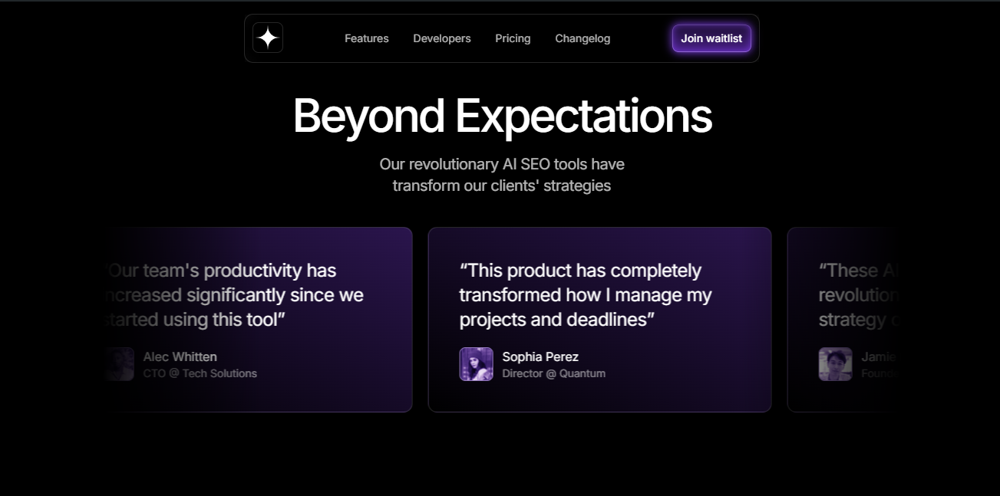

# About this App 📱💻

This is a [AI Landing Page](https://ia-landing-page.pages.dev/) built by `Diego Tech` by using:

- Next.js
- TypeScript

<br />





<br />

## Libraries I used for the App 🚀

- DotLottie React Player
- Lottiefiles DotLottie React
- Framer Motion
- Tailwind Merge

### One Message for EveryOne 🔥

> [!TIP]
> ```shell
> Aguante Argentina!!!
> Aguante Messi!!!
> ```